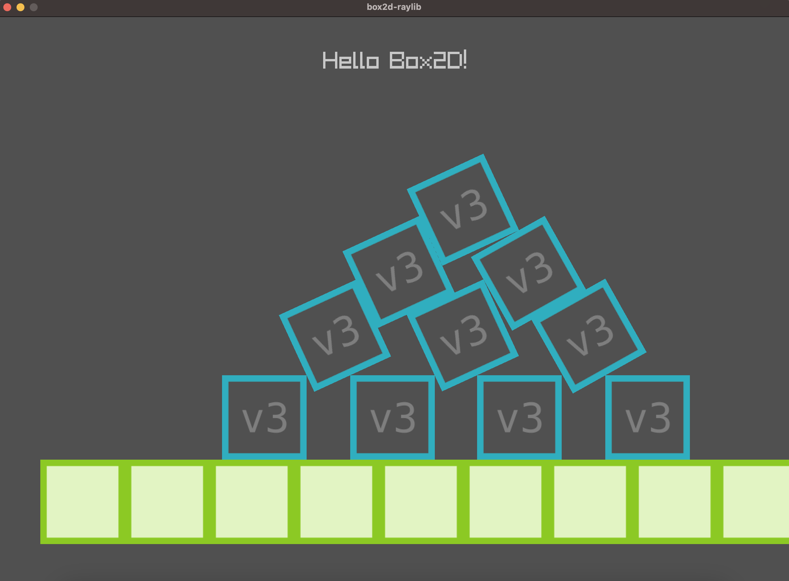

# raylib_box2d_d
 Example for raylib and box2d in D language (PoC)

## Installation
Currently to make the project working you need to install 2 libraries: raylib and box2d (version 3.x, because it was ported to C)

### Raylib
I've used [raylib-d]() library on macOS.
To install it I've sucessfully used the newer method of installation:
```bash
dub init
dub add raylib-d
dub upgrade
dub run raylib-d:install
```

### Box2d
At the time of the creation of this project in the homebrew was available only version 2.4.2

But because we have ImportC we can use fresh release of box2d like that:
```bash
git clone https://github.com/erincatto/box2d.git
cd box2d
./build.sh
```
It will generate build folder with `src/libbox2d.a` inside.

## Build
All other configurations and specific file for ImportC (box2d_lib.c) already prepared.
So you need only to run:
```bash
dub run
```
And it should work


## Credits
[box2d-raylib](https://github.com/erincatto/box2d-raylib) - example from raylib github

[raylib-d](https://github.com/schveiguy/raylib-d) - raylib D library